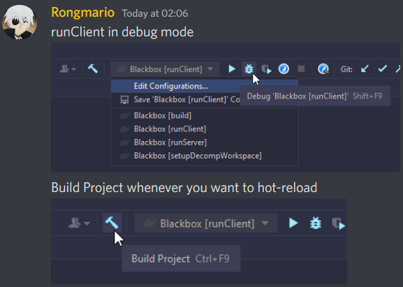

{ width="550" align=right }

  
1. Run :material-menu-right:`Run Client` or :material-menu-right:`Run Server` in :material-bug:`Debug Mode`
  
2. Whenever you change parts of your code, use the :hammer:`Build Project` next to the dropdown menu for run configurations.

  

!!! info
    When using either ForgeGradle 2.3 or RetroFuturaGradle. The steps are the same! Though, this may change once CleanroomGradle is released.

!!! warning
    This will not work for certain parts of the code, very noticeable checks (such as console log) in changed code are strongly advised!
