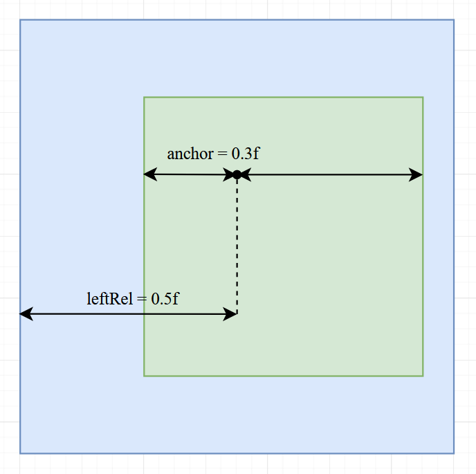

Each widget has several builder setter methods for position and size. They all come from the `IPositioned` interface.

## Sizing

- `width(int)` sets the widget width in pixels
- `widthRel(float)` sets the widget width relative to its parent (f.e. if the parent is 120 wide and we
  call`widthRel(0.5f)` then our widget will be 60 wide
- `heigth(int)` and `heightRel(float)` work analogue
- `size(int width, int height)` is equivalent to `.width(width).height(height)`
- `size(int val)` is equivalent to `.width(val).height(val)`
- `sizeRel(float width, float height)` and `sizeRel(float val)` work analogue
- `coverChildrenWidth()` makes the widget width wrapping tightly around its children
- `coverChildrenHeight()` works analogue
- `coverChildren()` wraps width and height tightly
- `expanded()` is only useful for children of `Row` and `Column` widgets. It will make the widget expand as much as
  possible in the widgets axis (width in row and height in column)

## Positioning

We can set position on four different points. Two for each axis. `left()`, `right()`, `top()` and `bottom()`.
To understand what they are doing take a look at the following picture:

As you can see the methods are fairly self-explanatory. Each of those methods has multiple variants much like `width()`
and `widthRel()`. Only methods for `left()` will be listed here.

- `left(int)` sets the x position in pixels relative to its parent
- `leftRel(float)` sets the relative x position relative to its parent (f.e. 0.5f will center the widget) (it might not
  be too easy to fully understand how this works right now
- `leftRelOffset(float val, int offset)` is the same as `leftRel()`, but also adds an `offset` in pixels after the
  calculation
- `leftRelAnchor(float val, float anchor)` is the same as `leftRel()`, but with a different anchor
  (see [Anchor](#anchor))
- `leftRel(float val, int offset, float anchor)` combines `leftRelOffset()` and `leftRelAnchor()`
- `left(float val, int offset, float anchor, Measure measure)` is `leftRel(float val, int offset, float anchor)`, but
  you can define the measure (pixels or relative yourself) (this method is mostly useless since offset and anchor are
  only effective with relative measure)
- `left(DoubleSupplier val, Measure measure)` is like `left()` and `leftRel()`, but with a dynamic value. Note that the
  supplier is only evaluated during resizing. You can't use for animating widgets.
- `leftRelOffset(DoubleSupplier val, int offset)` is like `leftRelOffset(float val, int offset)` with a dynamic value
- `leftRelAnchor(DoubleSupplier val, float anchor)` is like `leftRelAnchor(float val, float anchor)` with a dynamic
  value
- `leftRel(DoubleSupplier val, int offset, float anchor)` combines the two methods above

All the above variants also exist for `right()`, `top()` and `bottom()`.
Additionally, there is

- `pos(int x, int y)` combines `left(int x)` and `top(int y)`
- `posRel(float x, floaty)` combines `leftRel(float x)` and `topRel(float y)`

### Anchor

The anchor is the point of the widget at which the widget will be positioned with the relative value. The following
picture should make this clear. In the picture `leftRelAnchor(0.5f, 0.3f)` is called.

Here the anchor is placed at `0.3f`, which is about a third of the widget.
And that anchor is positioned at `0.5f` of the parent widget (the center).
Try imagining what happens with different anchor values and play around with it by yourself.

If we had called `leftRel(float val, int offset, float anchor)`, then the offset would be added after the anchor
and relative position calculation.

## Combining Size and Position

Of course, you can call multiple position and size methods, but you should be aware of its effects and limitations.

Each axis (x and y) has 3 setters (x has `left()`, `right()` and `width()`, y has `top()`, `bottom()` and `height()`)
without including all the variations.

!!! Note 
    You can call at most 2 setters for each axis, since with two properties set the last one can always be calculated!

For example of you call `left()` and `right()` then the width can be calculated with `right - left`.
Setting all three properties for an axis will cause a crash (?).

!!! Note
    You don't need to call any setters. The position defaults to (0|0) and the size defaults to 18 by 18 (for most widgets).

## Changing the relative Parent
By default, the size and position are calculated relative to the direct widgets parent. But that can be changed with 
`relative(Area)`, `relative(IGuiElement)` and `relativeToScreen()`.
The parent of all panels is by default the screen.

!!! Warning
    Changing the relative widget might cause some unexpected results in some edge cases. Please notify me if you run
    into one of those.
